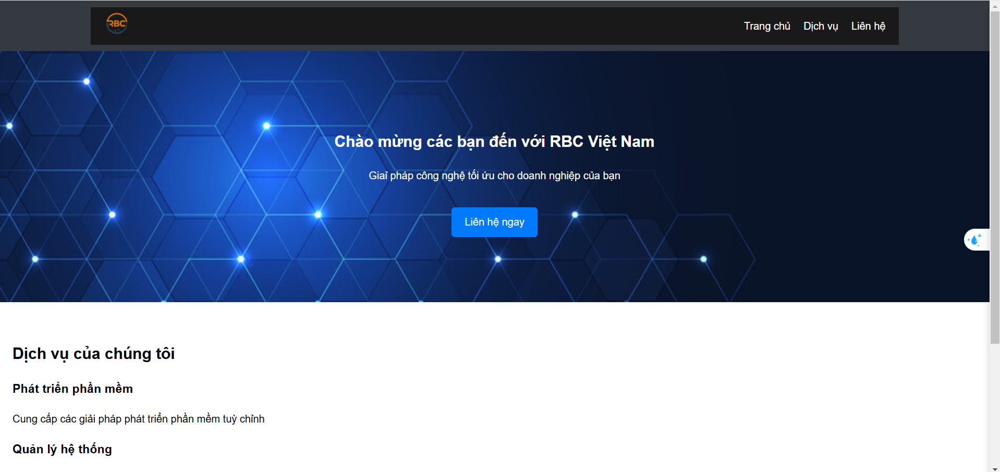
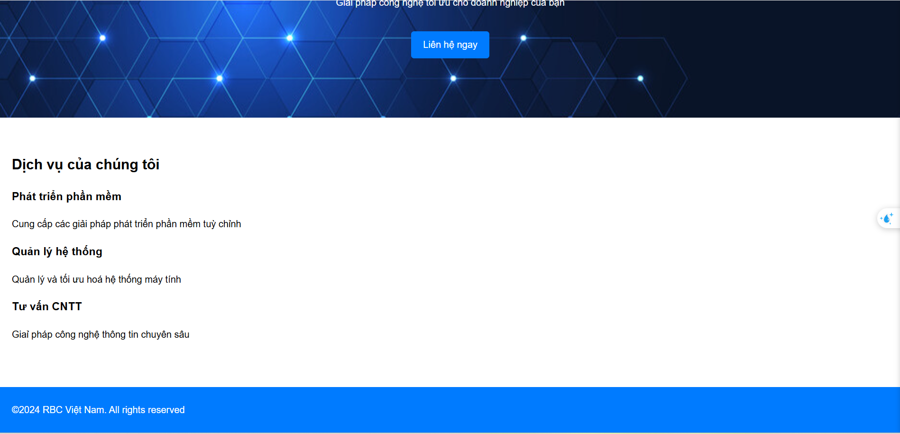

# Bài thực hành 1: Tạo trang web cơ bản với HTML và CSS

## Mục tiêu:

- Hiểu được cấu trúc cơ bản của 1 trang web bằng HTML
- Sử dụng CSS để định dạng giao diện trang web
- áp dụng các thuộc tính CSS cơ bản để cải thiện trải nghiệm người dùng

# Yêu cầu

Sinh viên sẽ tạo 1 trang web cơ bản với các phần:

1. **Header** chứa logo và thanh điều hướng với các liên kết đến các phần khác nhau trong trang web
2. **Hero section** 1 phần nổi bật giới thiệu về trang web chứa tiêu đề và nút kêu gọi hành động (CTA)
3. **Services section** mô tả các dịch vụ mà công ty cung cấp
4. **Footer** chứa thông tin bản quyền

## Cấu trúc thư mục

Sinh viên tổ chức các tệp và thư mục trong dự án của mình theo yêu cầu:

```text
project/ (ví dụ lab01/)
|
|--images/
|   |--background-image.jpeg (tải trên mạng)
|   |--logo.png (tải trên mạng)
|
|--css/
|   |-- style.css
|
|--index.html (tệp mã HTML chính của trang web)
|--README.md (tệp này có định dạng markdown)
```

## KẾT QUẢ BÀI LAB



